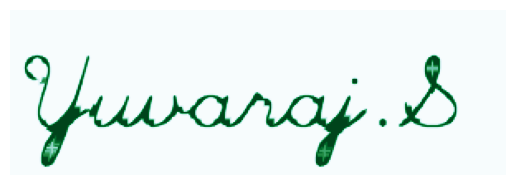

# Implementation-of-Erosion-and-Dilation
## Aim
To implement Erosion and Dilation using Python and OpenCV.
## Software Required
1. Anaconda - Python 3.7
2. OpenCV
## Algorithm:
### Step1:
Import the necessary packages.
### Step2:
Create the Text using cv2.putText.
### Step3:
Create the structuring element.
### Step4:
Erode the image using cv2.erode().
### Step5:
Dilate the image using cv2.dilate().
## Program:
# Import the necessary packages
```python
# Developed by : Yuvaraj.S
# Register Number : 22008589
import numpy as np
import cv2
import matplotlib.pyplot as plt
```


# Create the Text using cv2.putText
```python
# Developed by : Yuvaraj.S
# Register Number : 22008589
img1=np.zeros((100,300),dtype='uint8')
font=cv2.FONT_HERSHEY_SCRIPT_SIMPLEX 
```


# Create the structuring element
```python
# Developed by : Yuvaraj.S
# Register Number : 22008589

cv2.putText(img1,'Yuvaraj.S',(5,70),font,2,(255),5,cv2.LINE_AA)
plt.imshow(img1,cmap='PuRd')
plt.axis("off")
kernal=np.ones((5,5),np.uint8)
kernel1=cv2.getStructuringElement(cv2.MORPH_CROSS,(7,7))
```


# Erode the image
```python
# Developed by : Yuvaraj.S
# Register Number : 22008589
img_erode=cv2.erode(img1,kernel1)
plt.imshow(img_erode,cmap='BuGn')
plt.axis("off")
```


# Dilate the image
```python
# Developed by : Yuvaraj.S
# Register Number : 22008589
img_dilate=cv2.dilate(img1,kernel1)
plt.imshow(img_dilate,cmap='GnBu')
plt.axis("off")
```
## Output:

### Display the input Image

### Display the Eroded Image


### Display the Dilated Image

## Result
Thus the generated text image is eroded and dilated using python and OpenCV.